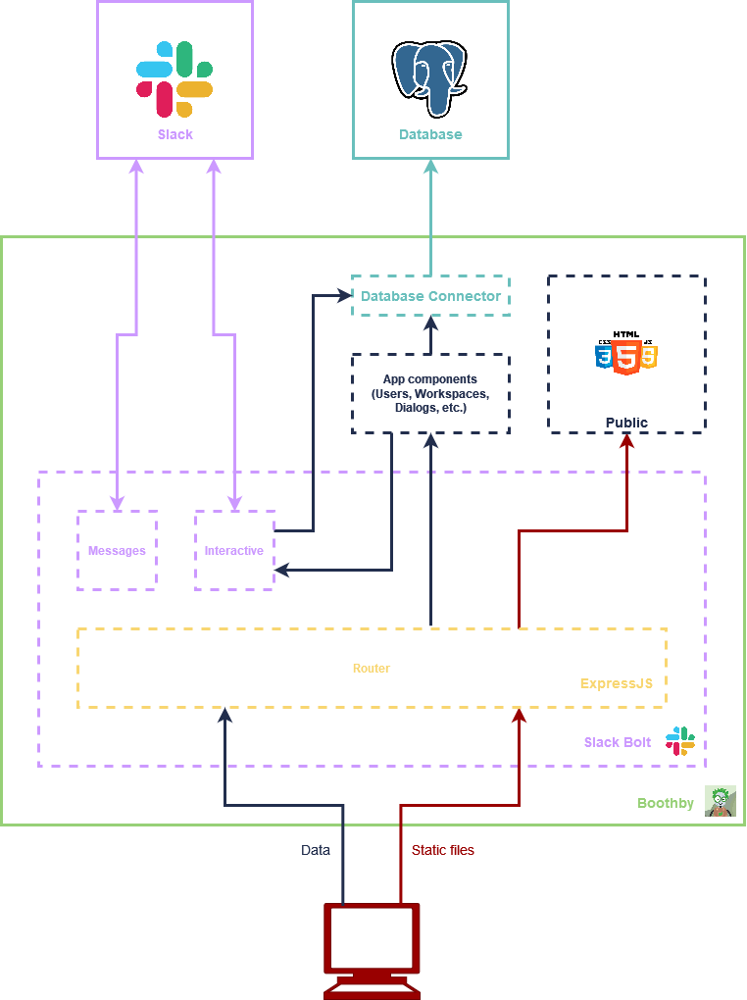

# Architecture

This software depends on two external components :
- The Slack API
- A PostgreSQL Database

Furthermore, this software is devivded in two main components :
- The web interface, located in `public` folder
- The backend written in NodeJS inside `src` folder

In addition to all of that, we try to implement that bot with sustainable computing development best practices such as use less library/framework as possible.

